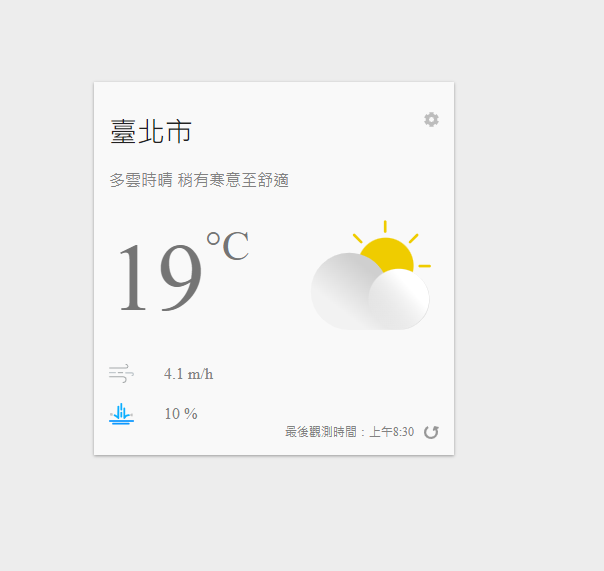
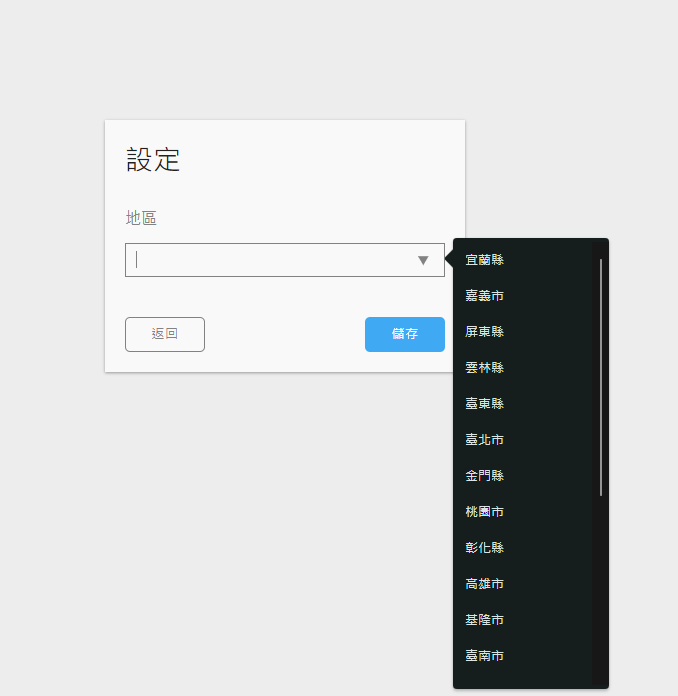
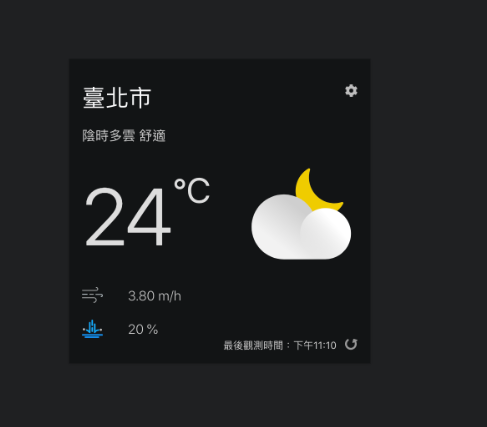

# 作品連結

### https://samtash1034.github.io/Weather-APP/

# 使用技術

- React18
- JS
- emotion(css in js)

# 功能介紹

1. 點擊右上方齒輪可以選擇地區(縣市下拉選單)
2. 畫面顯示地點、天氣敘述、溫度、風速、降雨機率、最後觀測時間
3. 點擊重新整理可以抓取最新一筆的天氣資料
4. 背景圖示會根據日落日出時間來調整深色淺色

# 參考資料

1. [從 Hooks 開始，讓你的網頁 React 起來](https://ithelp.ithome.com.tw/users/20103315/ironman/2668)
2. [中央氣象局 Opendata API 線上說明文件](https://opendata.cwb.gov.tw/dist/opendata-swagger.html)
